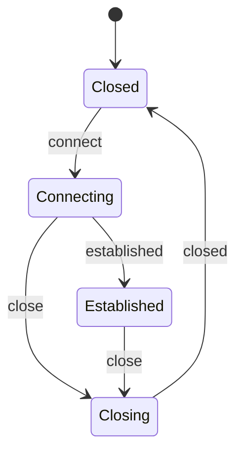

# State machines

Overall disposition: PORTS_AS_IS.

The decision criteria, graph discipline, diagram practice, deferred event
pattern, and test shape all port. The implementation technology changes.
Python can use a small transition table, `transitions`, `python-statemachine`,
or a domain-specific dataclass plus `match`, depending on complexity.

## When a state machine is the right tool

Disposition: PORTS_AS_IS.

Keep the list. Python code is especially prone to correlated boolean drift:
`connected`, `connecting`, `closing`, `retrying`, and `pending` become invalid
combinations unless the state graph is explicit.

## When not to use one

Disposition: PORTS_AS_IS.

Keep it. A one-bit flag, a linear transform, or a simple variant does not need
a framework. In Python, the cost is runtime indirection and extra vocabulary
rather than template compile time.

## Implementing with Boost.SML

Disposition: PYTHON_SPECIFIC_VARIANT.

Rewrite around Python choices:

- Hand-written table for small and medium machines.
- A library when entry/exit actions, guards, and diagrams justify it.
- Dataclass variants plus `match` when state carries different data.

Small table rendering:

```python
type State = Literal["closed", "connecting", "established", "closing"]
type Event = Literal["connect", "established", "close", "closed"]

TRANSITIONS: dict[tuple[State, Event], State] = {
    ("closed", "connect"): "connecting",
    ("connecting", "established"): "established",
    ("connecting", "close"): "closing",
    ("established", "close"): "closing",
    ("closing", "closed"): "closed",
}
```

## Anatomy of a transition table

Disposition: PORTS_WITH_ADAPTATION.

Keep the table anatomy: source state, event, optional guard, action, target
state. Render with dataclasses when actions and guards are needed.

```python
@dataclass(frozen=True)
class Transition:
    source: State
    event: Event
    target: State
    action: Callable[[], None] | None = None
```

## Wiring the machine into its owner

Disposition: PORTS_AS_IS.

Keep it. The owner translates public methods into events and provides actions.
Expose semantic accessors rather than raw state names.

```python
class Session:
    def connect(self) -> None:
        self._machine.process("connect")

    @property
    def established(self) -> bool:
        return self._machine.state == "established"
```

## Deferred events

Disposition: PORTS_AS_IS.

Keep it. Re-entrance hazards are not C++-specific. Use an internal queue or
post to the owning loop.

```python
def process(self, event: Event) -> None:
    if self._processing:
        self._pending.append(event)
        return
    ...
```

## Queue container choice

Disposition: PORTS_WITH_ADAPTATION.

Replace container micro-choices with `collections.deque`, `asyncio.Queue`, and
bounded queues where backpressure is part of the contract.

## Embedded PlantUML for documentation and verification

Disposition: PORTS_AS_IS.

Keep diagrams, but use Mermaid by default for markdown guides unless the code
base already uses PlantUML.



## Testing a state machine

Disposition: PORTS_AS_IS.

Keep edge-by-edge tests and one full lifecycle. Python pytest examples:

```python
def test_session_connects() -> None:
    actions = RecordingActions()
    machine = SessionMachine(actions)

    machine.process("connect")

    assert machine.state == "connecting"
    assert actions == ["async_connect"]
```

Direct state injection is acceptable for edge tests when the machine exposes a
test helper or fixture.

## Anti-patterns

Disposition: PORTS_AS_IS.

Keep all anti-patterns: business logic inside transition lambdas, implicit
transitions, diagram drift, unnecessary nested machines, defer as a missing
edge workaround, re-entrant processing, and leaking raw state names.
